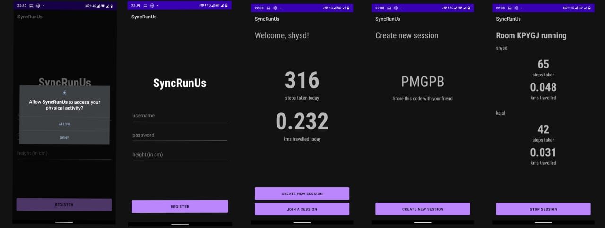

# SyncRunUs
Share your stats while running or walking with a friend!

## Description
SyncRunUs is an Android app (minimum Android version 8.0.0, API Level 26). It is a step counter but with a unque feature wher eyou can join a room with one other friend, and share your stats with them in real-time, like Steps taken in that session and kms walked.
SyncRunUs uses MQTT for communication

## Build details
Uploaded on GitHub is the whole Android Studio project. If you wish to develop on this project, clone the whole repository and open it in Android Studio.
Make sure to change the app name accordingly.

## Screenshots

